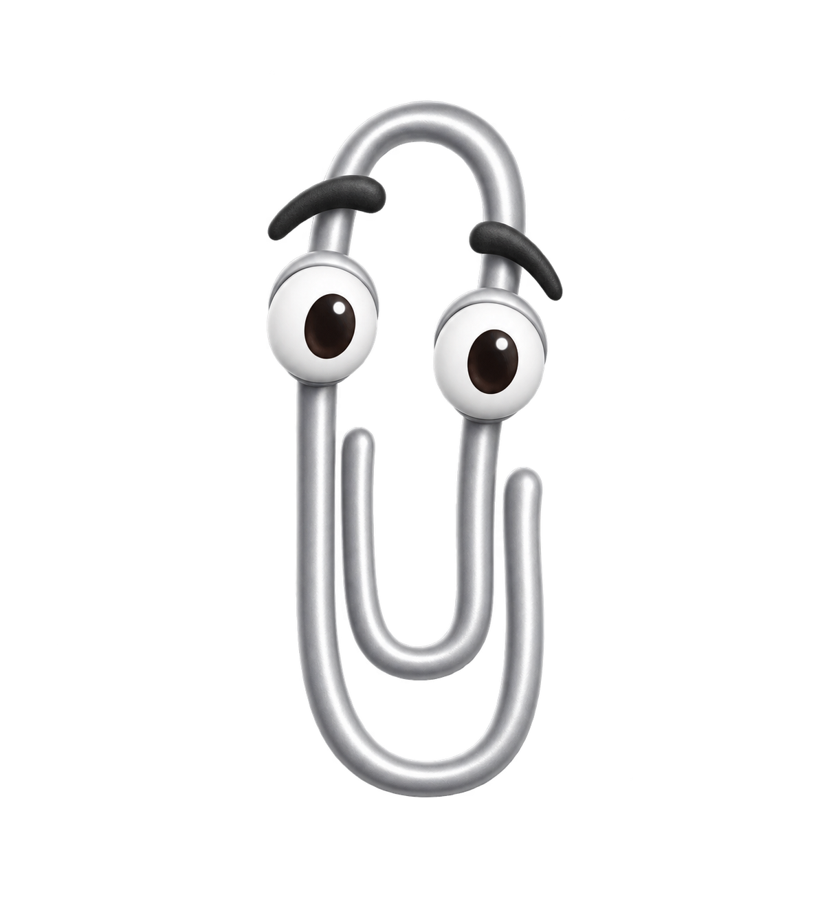
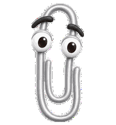
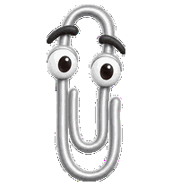
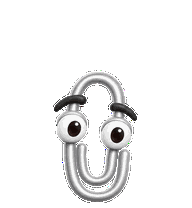

# cgpt-clip

A Clippy-inspired animated companion for ChatGPT desktop pets and Codex, created with hatch-pet and imagegen.



**Status:** work in progress. The character reference and build tools are available; all nine standard animation states have passed visual review; the sixteen gaze directions and final packaging are ongoing. There is no installable pet package yet.

## What's here

- `source/references/`: canonical character image and animation layout guides.
- `source/prompts/`: exact image-generation prompts for the character, animation strips, and gaze directions.
- `source/pet_request.json`: character and atlas specification.
- `tools/`: deterministic Python tools from the hatch-pet workflow for extraction, assembly, previews, and validation.

The target is a Codex v2 atlas: 1536 × 2288 pixels, 8 × 11 cells, nine animation states and sixteen gaze directions. Each cell is 192 × 208 pixels.

## Animation preview

  

## Import into ChatGPT pets

The installable files are still being validated. Use these steps once the `pet/` and `web/` folders appear in this repository; the reference image above is not an installable sprite sheet.

### ChatGPT desktop (macOS)

Download this repository using **Code → Download ZIP**, unzip it, and open the downloaded folder. Copy both files from `pet/clippy/` into `~/.codex/pets/clippy/` (or `$CODEX_HOME/pets/clippy/` if you configured a custom location):

```text
~/.codex/pets/clippy/
  pet.json
  spritesheet.webp
```

In Finder, **Go → Go to Folder…** opens `~/.codex`; create the `pets/clippy` folders if needed. Keep the two filenames unchanged. The manifest declares `spriteVersionNumber: 2` for the 1536 × 2288 desktop atlas.

In ChatGPT, open **Settings → Pets**, click **Refresh**, and select **Clippy**. Enter `/pet` or choose **Show pet** in the command menu to display it. If absent, check the folder structure and restart the app.

### ChatGPT web

When Pets are available for your account/workspace, open **Settings → Personalization → Pet → Select pet → Upload pet** and select `web/clippy.webp`.

Web uploads require a transparent **1536 × 1872** PNG/WebP under **20 MiB**. Use the dedicated web export; the taller desktop v2 atlas will not meet that size requirement. Desktop pets do not automatically sync to the web.

Menu names and web requirements verified against [OpenAI's Pets documentation](https://learn.chatgpt.com/docs/pets). The local desktop folder layout follows this project's hatch-pet packaging contract.

## Working with the tools

Requires Python 3.10+ and Pillow:

```sh
python3 -m venv .venv
. .venv/bin/activate
pip install -r requirements.txt
python tools/prepare_pet_run.py --help
python tools/validate_atlas.py --help
```

Image generation is a separate step using the included prompts and reference images. These tools do not call an image API or generate missing artwork. Every animation strip needs its own generated, visually reviewed source before assembly. Look rows must preserve the clockwise direction sequence and pass independent visual review.

To validate a completed atlas:

```sh
python tools/validate_atlas.py path/to/spritesheet.webp --chroma-key '#FF00FF' --require-v2 --json-out validation.json
```

The finished package will contain `pet.json` with `spriteVersionNumber: 2` and `spritesheet.webp`, together with visual previews and QA reports.

## Credits

Character concept: Clippy, Microsoft's paperclip assistant. This is an unofficial fan project. Artwork generated with OpenAI imagegen; build and QA utilities supplied by the hatch-pet skill.

## License

Original project contributions are available under the [MIT License](LICENSE), copyright © 2026 Guy Ratcliffe. You can use, modify, and share them under its terms.

The bundled hatch-pet Python tools retain their [Apache 2.0 license](LICENSES/Apache-2.0.txt). See [third-party notices](THIRD_PARTY_NOTICES.md) for attribution and artwork scope. Neither license grants rights to Microsoft's Clippy branding or character.
